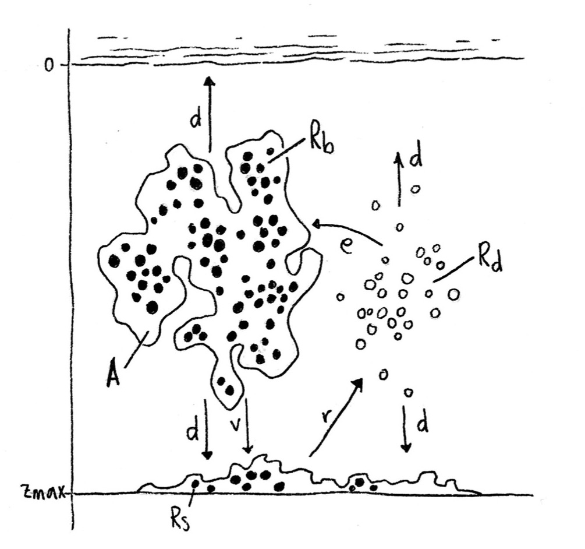

# Phytoplankton population dynamics in a vertical freshwater column
Phytoplankton is a significant primary producer and at the base of the aquatic food chain, and understanding its dynamics can help form a basis for predictions about entire marine ecosystems. 

A 1D reaction-advection-diffusion equation reduces the complex list of factors which affect some population to it’s patch size, production rate, death rate, and rates of spreading (advection and diffusion).

$$
\begin{align}
\frac{\partial A}{\partial t} &=p(I,q)A - l_{bg}A - v \frac{\partial A}{\partial z} + d \frac{\partial^2 A}{\partial z^2}\\
\frac{\partial R_b}{\partial t} &=\rho (q,R_d)A - l_{b g}Rb - v \frac{\partial R_b}{\partial z} + d \frac{\partial^2 R_b}{\partial z^2}\\
\frac{\partial R_d}{\partial t} &=- \rho (q,R_d)A + l_{b g}Rb + d \frac{\partial^2 R_d}{\partial z^2}\\
I(z) &= I_0 exp- \left( \int_0^z k A dz + k_{b g}z \right) \\
\frac{\partial R_s}{\partial t} &= v R_b(z_{max}) - r R_s
\end{align}
$$

with functions $p$ and $\rho$,

$$
\begin{align}
    p(I,q) &= \mu_{max} \left( \frac{q-q_{min}}{q}\right)\frac{I}{h+I}\\
    \rho(q,R_d) &= \rho_{max} \left( \frac{q_{max}-q}{q_{max}-q_{min}} \right) \frac{R_d}{m+R_d} 
\end{align}
$$

and, 

$$
\begin{equation}
q=\frac{R_b}{A}
\end{equation}
$$

Phytoplankton take in dissolved nutrients (white dots) at a rate $\rho$, converting them to particulate nutrients (black dots) bound in the phytoplankton. The bound nutrients diffuse up and down at a rate d and sink at a rate $v$ with the phytoplankton cloud. When bound nutrients reach $z_\max$ they become sedimented as $R_s$. Sedimented nutrients are released back into the water column as dissolved nutrients at a rate $r$. The dissolved nutrients also diffuse up and down at a rate $d$ but do not sink.

 

